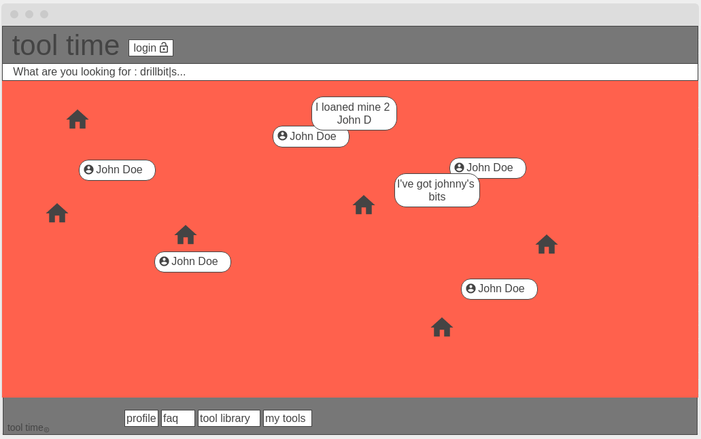
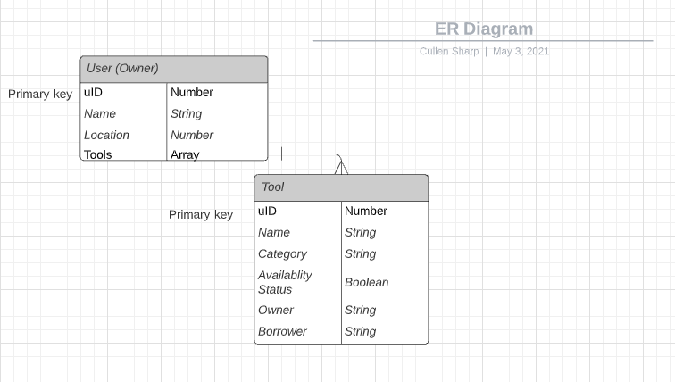

# Tool-Time

## Authors: Dion Johnson, Michael Campbell, Rinat Galeev, Cullen Sharp

## Cooperation Plan

### Strengths

- Dion - Determined, accountable, influential (brings the coffee)

- Michael - Communication, documentation and inclusion

- Rinat - Multitasking, problem solving

- Cullen's - Adaptability, accountability, teaching

### How to utilize these skills

Dion's determination to bring use through. Rinat's multi-tasking for logistics fast work times. Michael's communcation will help use build team morale. Good documentation to so everyone is onboard and explain. Cullen's adaptability to keep production moving smoothly. And with Rinat's problem-solving, we should be able to overcome bugs.

### Compentencies to develop

Teamwork, craft, communication skills, making cool software

## Conflict Resolution

Full transperancy with and communication, give each member the benefit of the doubt. Be open to compromise, selflessness.

Speak up, put it back on track.

Patience, and teaching.

Communication, bring it to the person and get them onboard.

If the conflict needs to escalate, we'll bring it to the attention of the whole team. If that doesn't work, maybe get an instructor to mediate.

## Communication plan

Hours available: 8am to 10pm

Platforms: Slack, and Remo

How often will you take breaks: as needed

If you an individual member is falling behind, they should reach out. The reverse is possible too.

We will ensure that everyone is heard through making space and roundtable discussion.

We'll ensure a safe environment by cultivating mutual respect.

## Work plan

We'll use Trello and Github pages for logistics. Small groups will meet each day, and full group retros/stand-ups will allow use to plan each task. Things will be flexible, but not stepping on toes.

## Git process

Most the work will live on Github, but everyone will have their own workspace. Everyone will have full permissions on the repo, but merges should require at least one approval other than the person who made the request.

We'll all do work on our own branches, then merge to production after review.

We'll merge daily, and we'll know when to merge when there aren't any conflicts post-review. Call it at 6pm.

## Wireframe

## User Stories

### Tool search

As a user I want to see available tools in my community.

#### **Feature tasks**

- Search the database of users for users that have the tool available.

- Build a database of users

#### **Acceptance tests**

- When I search for a tool, I'm returned a list of users with that tool near me.

### My Tool shed

As a user I want to see my tools in my profile.

#### **Feature tasks**

- I have a list of tools associated with a profile

- When I access my profile I get all my tools

- I can modify adding and deleting tools from my shed

#### **Acceptance tests**

- When I open the profile page, I get my profile information and can see the tools I have available

### Tool CRUD

As a user I want the ability to loan or borrow tools

#### **Feature tasks**

- When a tool is 'borrowed' add it to the borrowers shed temporarily

- Keep track of who has what, and what is loaned

#### **Acceptance tests**

- When a user borrows a tool from another userm the tool should appear in the borrowing user's shed with a note about where it came from.

### Tools by category

As a user I want search tools by category, so that I'm shown only tools relevant to my search.

#### **Feature tasks**

- All tools should include category as part of their model

- Enable search functionality

#### **Acceptance tests**

- Only a list of tools associated with the search category should be shown.

## Domain modelling

User contains:

- Name (String)

- email (String)

- latitude (Number)

- longitude (Number)

- tool list (Array)

- Rating (Number)

Each tool contains:

- Tool name (String)

- Owner (String)

- Borrower (String)

- Whether or not it's borrowed (Boolean)

- Category to tool (String)

## Entity relationship diagram

